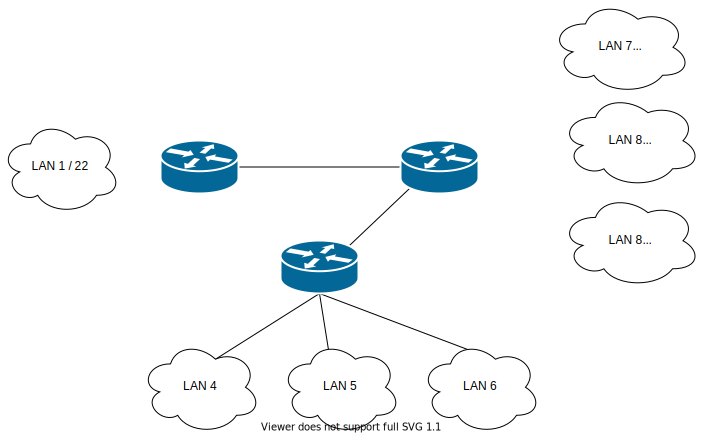

# Task 1:

The organization plans to start operations in 3 buildings, each of them provides up to 1000 IP devices.

1. Design and document a solution prototype using the software  CISCO Packet Tracer.
  * Addresses of individual IP networks
  * Link addressing between routers
  * Routing tables on individual routers

# Scheme

# Solution:

 

I used public IP addresses from the [website](https://42.pl/pl/networks.html?html=1) to address individual networks. Each network is able to handle 1022 usable ip addresses.

### Networks

| Network| ip  | mask  | min  |  max | hosts_max  |
| ---|---|---|---|---|---|
| 1|  91.236.84.0/22 |255.255.252.0   | 91.236.84.1  | 91.236.87.254  | 1022  |
| 2|  185.33.36.0/22 | 255.255.252.0  | 185.33.36.1  |  185.33.39.254 | 1022   |
| 3| 194.28.228.0/22  | 255.255.252.0  | 194.28.228.1  | 194.28.231.254  |  1022 |

###### Devices:

* Network 1 : 
  * Server - 91.236.84.2
  * Router - 91.236.84.1

* Network 2 : 
  * Laptop - 185.33.36.2
  * Router - 185.33.36.1

* Network 3 : 
  * Laptop - 194.28.228.2 \
  * Router - 194.28.228.1 

## Link addressing between routers

The networks are linked by 3 routers. each router-router connection has a private network(10.x.x.x). For each router I added 2 new Fiber interfaces able to handle these connections.

* Network1 - Network3: 10.0.0.8/30
  * Router1 ip_2: 10.0.0.9 ------- Router3 ip_2:10.0.0.10

* Network1 - Network2: 10.0.0.0/30
  * Router1 ip_1:10.0.0.1  ------- Router2 ip_1:10.0.0.2

* Network2 - Network3: 10.0.0.4/30
  * Router2 ip_2:10.0.0.5  ------- Router2 ip_1:10.0.0.6

## Routing Tables

### Router1:
| Destination                    | Gateway               
| -------------                 |:-------------:            
| 185.33.36.0/22|   10.0.0.2         |
| 194.28.228.0/22|   10.0.0.10         |  

#### Router2:
| Destination                    | Gateway               
| -------------                 |:-------------:            
| 91.236.84.0/22|   10.0.0.1          |
| 194.28.228.0/22| 10.0.0.6         |  

#### Router3:
| Destination                    | Gateway               
| -------------                 |:-------------:            
| 91.236.84.0/22  | 10.0.0.9         |
| 185.33.36.0/2  |  10.0.0.5        |  

| -------- --------------------------------

# Task 2:

The network design has met the expectations, the organization, taking into account the new requirements, wants to divide the existing networks into several subnets.

Design and document a prototype of the solution using CISCO Packet Tracer software

* LAN 1 remains unchanged
   * LAN 2 is divided into 3 equal subnets
   * LAN 3 is divided into 3 subnets including
     * Subnet 1 is to support up to 500 hosts
     * subnet 2 is to support up to 100 hosts
     * subnet 3 is to support up to 80 hosts
   * The link between Router (LAN 1) and Router (LAN 2) has also been removed
   * Include changes to the routing table

# Scheme

# Solution:

In order to divide network number 3 into 3 equal subnets, I had to dedicate two bits from some hosts part to the mask part of network address. This is how 4 equal subnets were created, of which I will only use three.A similar process occurs with the division of network number 2. This time, however, I took into account the number of hosts. One network was created with a maximum of 510 hosts and two with max of 126, each starting next to end of another.

After removing the link between router 1 and 3, I had to rewrite the routing table to keep the connections between the networks.

### Networks

| Network| ip  | mask  | min  |  max | hosts_max  |
| ---|---|---|---|---|---|
| 1|  91.236.84.0/22 |255.255.252.0   | 91.236.84.1  | 91.236.87.254  | 254  |
| 4|  185.33.36.0/24 | 255.255.255.0  | 185.33.36.1  |  185.33.36.254 | 254   |
| 5| 185.33.37.0/24  | 255.255.255.0  | 185.33.37.1  | 185.33.37.254  |  254 |
| 6|  185.33.38.0/24 | 255.255.255.0   | 185.33.38.1  | 185.33.38.254  | 254  |
| 7|  194.28.228.0/23 |255.255.254.0   | 194.28.228.1  | 194.28.229.254  | 510  |
| 8|  194.28.230.0/25 |255.255.255.128  | 194.28.230.1  | 194.28.230.254  | 126  |
| 9|  194.28.231.0/25 |255.255.255.128   | 194.28.231.1  | 194.28.231.126  | 126  |

###### Devices:

* Network 1 : 
  * Server - 91.236.84.2/22
  * Router - 91.236.84.1/22

* Network 4 : 
  * Laptop - 185.33.36.2/24
  * Router - 185.33.36.1/24

* Network 5 : 
  * Laptop - 185.33.37.2/24
  * Router - 185.33.37.1/24 
  
  
* Network 6 : 
  * Server - 185.33.38.2/24  
  * Router - 185.33.38.1/24

* Network 7 : 
  * Laptop - 194.28.228.2/23
  * Router - 194.28.228.1/23

* Network 8 : 
  * Laptop - 194.28.230.2/25   
  * Router - 194.28.230.1/25  

* Network 9 : 
  * PC - 194.28.228.2 \
  * Router - 194.28.231.2/25   

## Link addressing between routers

The networks are linked by 3 routers. each router-router connection has a private network(10.x.x.x). For each router I added 2 new Fiber interfaces able to handle these connections.

* Network1 - Network(7,8,9): 10.0.0.8/30
  * Router1 ip_2: 10.0.0.9 ------- Router2 ip_2:10.0.0.10

* Network(7,8,9) - Network(4,5,6): 10.0.0.4/30
  * Router3 ip_2:10.0.0.5  ------- Router2 ip_1:10.0.0.6

## Routing Tables

### Router1:
| Destination                    | Gateway               
| -------------                 |:-------------:            
| 185.33.36.0/22|   10.0.0.10         |
| 194.28.228.0/22|   10.0.0.10         |  

#### Router2:
| Destination                    | Gateway               
| -------------                 |:-------------:            
| 91.236.84.0/22|   10.0.0.9          |
| 185.33.36.0/22| 10.0.0.5         |  

#### Router3:
| Destination                    | Gateway               
| -------------                 |:-------------:            
| 91.236.84.0/22  | 10.0.0.6         |
| 194.28.228.0/22  |  10.0.0.6        |  

